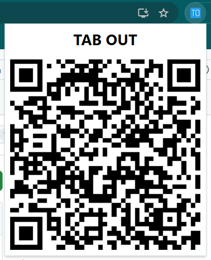

# TAB OUT
TAB OUT (TO) is a Chrome extension that simplifies sharing web pages between your PC and mobile devices. With a single click on the extension icon, it generates a QR code for the current tab's URL. Simply scan this code with any mobile device to instantly access the same page on your phone or tablet. This extension streamlines cross-device browsing, eliminating the need for manual typing or link sharing.

## Installation

Since this extension is not published on the Chrome Web Store, follow these steps to install it manually:

1. Clone this repository or download it as a ZIP file and extract it.
2. Open Google Chrome browser and navigate to `chrome://extensions/`.

3. Enable "Developer mode" by toggling the switch in the top right corner.

4. Click on "Load unpacked" button that appears after enabling developer mode.

5. Navigate to the directory where you cloned/extracted the extension files and select the folder.

6. The extension should now appear in your Chrome browser.